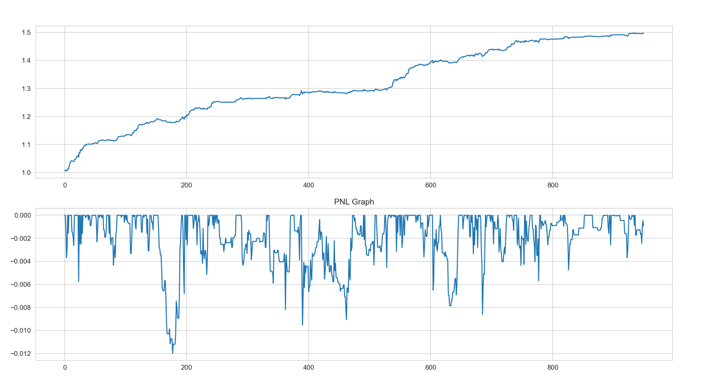

'Advances in Machine Learning'에 기반한 KOSDAQ 150 지수 데이터를 이용해 백테스팅 엔진 구현

1. Tick Data를 비롯한 High Frequency Data 이용한 전처리 : 시간 단위로 나뉘어져 있는 가격 데이터 > 거래 금액/거래량 기준으로 재구성
2. 1차 Base Model(Trading Strategy) 구축 : Price Momentum 강도를 판단할 지표와 이상치 구분을 위한 Parkinson Volatility 사용
3. 2차 Machine Learning Model 구축 : Random Forest 이용 > Base Model의 Signal의 True/False 여부 판단하는 모델

<PNL & MDD for Primary Model>

